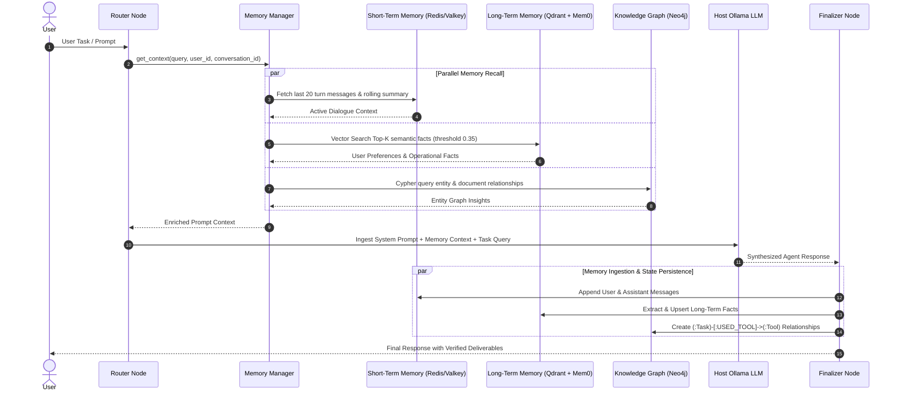
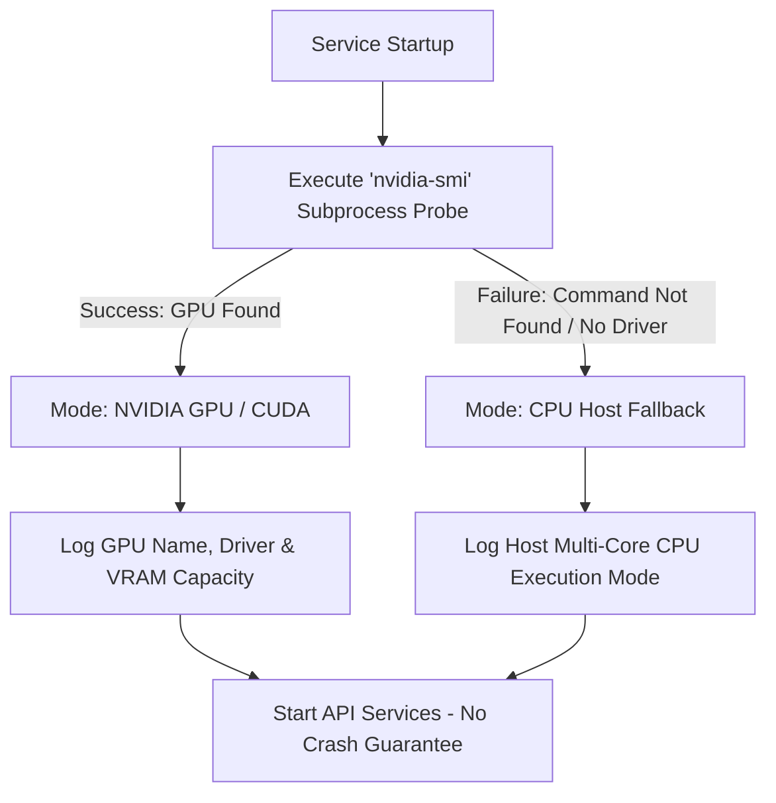

# Sovereign On-Premise Agentic AI Workbench — Architecture Guide

**SIH 2026 Project: Fully Air-Gapped, Sovereign Multi-Agent Operating Platform**  
Repository: [https://github.com/avinash2005bharti/sih2026.git](https://github.com/avinash2005bharti/sih2026.git)

---

## 1. System Overview & Air-Gapped Principles

The **Sovereign AI Workbench** is an enterprise-grade, fully on-premise, air-gapped multi-agent AI operating platform. Engineered for mission-critical, high-security industrial and defense environments, it operates with **zero external cloud API calls**, guaranteeing total data sovereignty, zero telemetry leakage, and complete cryptographic auditability.

### Core Architectural Pillars
- **100% Air-Gapped & Sovereign**: Zero dependence on proprietary external LLM APIs (OpenAI, Anthropic, Google Cloud). All language, embedding, vision, and OCR models execute locally.
- **Hardware-Aware Dual Runtime**: Ollama runs directly on the Windows host machine to leverage native NVIDIA CUDA acceleration when available, with seamless automatic fallback to host CPU execution without containerization overhead.
- **LangGraph Multi-Agent Orchestration**: Deterministic task classification, dynamic multi-step DAG planning, autonomous step verification, and multi-turn iterative self-correction across 16 specialized domain agents.
- **Model Context Protocol (MCP) Integration**: Standardized, isolated tool execution wrappers for filesystem operations, document manipulation, vector search, memory, OCR, slide generation, and Python sandboxing.
- **Tripartite Memory Architecture**: Unified cognitive memory coordinating Short-Term Conversation Memory (sliding window in Redis/MongoDB), Long-Term Semantic Memory (Qdrant vector collection + Mem0), and Episodic Knowledge Graphs (Neo4j Cypher property graphs).
- **Industrial OCR & Vision Studio**: Localized text and tabular extraction using PaddleOCR with computer vision preprocessing (deskewing, binarization, noise filtering) and multimodal vision models.
- **Tamper-Evident Egress Interceptor**: Kernel/socket-level network monitoring that intercepts and blocks outbound connections, logging events to a rolling SHA-256 cryptographic audit chain.

---

## 2. High-Level System Architecture Diagram

```mermaid
flowchart TD
    subgraph Client_Tier [Client Presentation Tier]
        UI[React 18 + Vite Frontend<br/>Port 5173]
        ChatView[Chat & Reasoning Drawer]
        DocView[Document Repository]
        AgentView[Multi-Agent Grid]
        MonitorView[Air-Gap Network Monitor]
        ReportView[Report & Artifact Viewer]
    end

    subgraph Gateway_Tier [Application & Gateway Tier]
        Gateway[Node.js / Express Server<br/>Port 5000]
        SocketIO[Socket.IO Server<br/>Real-Time Step & Token Streaming]
        AuthRBAC[JWT RBAC Controller<br/>Admin / Analyst / Operator / Viewer]
        DocIngest[Document Ingestion & Multer Upload]
        AuditLog[Audit & Activity Logger]
    end

    subgraph AI_Services_Tier [AI Services & Agentic Orchestration Tier]
        FastAPI[Python FastAPI Service<br/>Port 8000]
        
        subgraph Orchestration_Engine [LangGraph Orchestration DAG]
            Classifier[Deterministic Task Classifier]
            RouterNode[Router Node]
            PlannerNode[Planner Node]
            SelectorNode[Agent Selector Node]
            ExecutorNode[Sandboxed Executor Node]
            VerifierNode[Verifier Node]
            FinalizerNode[Finalizer Node]
        end

        subgraph Specialized_Agents [16 Domain Specialized Agents]
            GeneralAgent[General Agent]
            CodingAgent[Coding Agent]
            DocAgent[Document Agent]
            SpreadsheetAgent[Spreadsheet Agent]
            PPTAgent[PPT Agent]
            OCRAgent[OCR Agent]
            VisionAgent[Vision Agent]
            KnowledgeAgent[Knowledge Agent]
            MemoryAgent[Memory Agent]
            FilesystemAgent[FileSystem Agent]
            RiskAgent[Risk Analysis Agent]
            SafetyAgent[Safety Agent]
            ComplianceAgent[Compliance Agent]
            MaintenanceAgent[Maintenance Agent]
            ReportingAgent[Reporting Agent]
            RouterAgent[Router Agent]
        end

        subgraph Tool_Registry [Sandboxed Tool Registry & MCP Layer]
            MCP_FS[Filesystem MCP]
            MCP_Doc[Document MCP]
            MCP_Code[Python MCP Sandbox]
            MCP_Data[Spreadsheet MCP]
            MCP_Pres[PPT MCP]
            MCP_OCR[OCR MCP]
            MCP_Vis[Vision MCP]
            MCP_RAG[Knowledge MCP]
            MCP_Mem[Memory MCP]
        end

        subgraph Memory_System [Tripartite Memory Subsystem]
            MemMgr[Unified Memory Manager]
            STM[Short-Term Memory Manager]
            LTM[Long-Term Memory Manager]
            Mem0[Mem0 Extraction Service]
            GraphClient[Neo4j Cypher Client]
        end

        subgraph OCR_Vision [OCR & Vision Engine]
            Paddle[Local PaddleOCR Engine]
            CVPre[Image Preprocessor]
            VisionModel[Local Vision Model]
        end

        subgraph Security_Guard [Sovereign Security Guard]
            NetMon[Network Egress Monitor]
            AuditChain[Rolling SHA-256 Audit Chain]
        end
    end

    subgraph Host_Inference_Tier [Host Local LLM Inference Tier]
        HostOllama[Local Ollama Daemon<br/>Port 11434 on Windows Host]
        GPU[(NVIDIA CUDA GPU)]
        CPU[(Host Multi-Core CPU)]
    end

    subgraph Infrastructure_Tier [Infrastructure & Storage Tier (Docker Compose)]
        Mongo[(MongoDB 8.0<br/>Port 27017)]
        Valkey[(Valkey Cache<br/>Port 6379)]
        Qdrant[(Qdrant Vector DB<br/>Port 6333)]
        Neo4j[(Neo4j Graph DB<br/>Ports 7474 / 7687)]
    end

    %% Client to Gateway
    UI -->|HTTP REST / SSE| Gateway
    UI <-->|WebSocket Events| SocketIO

    %% Gateway to AI Services & DB
    Gateway -->|HTTP POST / Proxy| FastAPI
    Gateway -->|Mongoose ORM| Mongo
    Gateway -->|Session & Token Cache| Valkey

    %% FastAPI Internal Orchestration
    FastAPI --> Orchestration_Engine
    Orchestration_Engine --> Specialized_Agents
    Specialized_Agents --> Tool_Registry
    Specialized_Agents --> Memory_System
    Specialized_Agents --> OCR_Vision
    FastAPI --> Security_Guard

    %% AI Services to Host Models
    FastAPI -->|HTTP REST / Embeddings| HostOllama
    HostOllama -.->|Auto-Detect CUDA| GPU
    HostOllama -.->|Fallback| CPU

    %% AI Services to Infrastructure
    Memory_System -->|Store / Query Vectors| Qdrant
    Memory_System -->|Cypher Queries| Neo4j
    Memory_System -->|Context / Sliding Window| Valkey
    Memory_System -->|Audit & State| Mongo
    Tool_Registry -->|Sandboxed I/O| FastAPI
```

---

## 3. Current Project Directory Structure

```text
sih2026-main/
├── .env.example                       # Reference environment variables
├── .gitignore                         # Git exclusion rules
├── AGENTS.md                          # Autonomous agent execution guidelines
├── docker-compose.yml                 # Root container orchestrator
├── start-all.bat                      # Windows one-click startup batch script
├── start-services.ps1                 # PowerShell automated service launcher
├── stop-all.bat                       # Service termination script
├── IMPLEMENTATION_SUMMARY.md          # Implementation progress and phase reports
├── SOVEREIGN_BACKEND_ARCHITECTURE.md  # System Architecture Guide (This document)
├── README.md                          # Repository overview & quick start
│
├── FRONTEND/                          # React 18 + Vite Web Application
│   ├── index.html                     # HTML5 application root entry
│   ├── package.json                   # Dependencies (React, Lucide, Tailwind, Socket.IO)
│   ├── vite.config.js                 # Vite bundling configuration & dev proxies
│   ├── tailwind.config.js             # Styling configuration & sovereign theme tokens
│   ├── Dockerfile                     # Production container specification
│   └── src/
│       ├── App.jsx                    # Root routing & provider wiring
│       ├── main.jsx                   # React DOM entry point
│       ├── index.css                  # Global styles & Tailwind utilities
│       ├── api/                       # Axios HTTP client endpoints (13 modules)
│       │   ├── client.js              # Base configured Axios instance
│       │   ├── authApi.js             # Authentication & user sessions
│       │   ├── chatApi.js             # Chat session & message persistence
│       │   ├── agentApi.js            # Agent registry & status queries
│       │   ├── documentApi.js         # Document upload & metadata API
│       │   ├── knowledgeApi.js        # Knowledge base & graph queries
│       │   ├── modelApi.js            # Ollama model discovery & management
│       │   ├── networkApi.js          # Air-gap telemetry & egress audit
│       │   ├── settingApi.js          # System configuration endpoints
│       │   ├── taskApi.js             # Asynchronous task polling
│       │   ├── toolApi.js             # Tool schema discovery
│       │   ├── workflowApi.js         # Workflow execution status
│       │   └── adminApi.js            # Administrative user & role management
│       ├── components/                # Reusable UI component library
│       │   ├── chat/                  # Chat components (Hero, Input, Message, Reasoning)
│       │   ├── layout/                # Layout (Sidebar, TopHeader, AppLayout, MobileNav)
│       │   ├── admin/                 # User management modals & role tables
│       │   ├── common/                # Buttons, loaders, badges, confirmation modals
│       │   └── protected/             # RBAC route authentication guards
│       ├── context/                   # Global application state
│       │   ├── AuthContext.jsx        # JWT authentication & session lifecycle
│       │   └── ChatContext.jsx        # Active chat, model selection, socket sync
│       ├── hooks/                     # Custom React hooks (socket, telemetry, debouncing)
│       ├── pages/                     # Primary top-level route views
│       │   ├── ChatPage.jsx           # Real-time multi-agent chat workbench
│       │   ├── AgentsPage.jsx         # 16 Specialized agents status & capabilities
│       │   ├── DocumentsPage.jsx      # Document management, ingestion & preview
│       │   ├── KnowledgePage.jsx      # Knowledge base & semantic graph inspector
│       │   ├── MonitoringPage.jsx     # Sovereign air-gap & network telemetry
│       │   ├── ReportsPage.jsx        # Generated artifacts, PDF & spreadsheet viewer
│       │   ├── SettingsPage.jsx       # Hardware, Ollama, model & profile settings
│       │   ├── LoginPage.jsx          # Secure sovereign authentication portal
│       │   ├── RegisterPage.jsx       # User self-registration portal
│       │   ├── ForgotPasswordPage.jsx # Password recovery portal
│       │   └── NotFoundPage.jsx       # 404 fallback page
│       └── services/                  # Socket.IO client connection manager
│
├── BACKEND/                           # Node.js + Express API Gateway
│   ├── server.js                      # HTTP & Socket.IO server initialization
│   ├── package.json                   # Dependencies (Express, Mongoose, Socket.IO, JWT)
│   ├── Dockerfile                     # Backend container specification
│   ├── uploads/                       # Server-side uploaded document storage
│   └── src/
│       ├── app.js                     # Express application, routes & error handlers
│       ├── controllers/               # Route business logic (11 controllers)
│       │   ├── admin.controller.js    # User administration & role changes
│       │   ├── agent.controller.js    # Agent catalogue & routing proxies
│       │   ├── auth.control.js        # Authentication, JWT, and password hashing
│       │   ├── chat.controller.js     # Conversation history & chat messages
│       │   ├── document.controller.js # Multi-part document upload & chunking
│       │   ├── knowledgeBase.controller.js # RAG knowledge collection management
│       │   ├── model.controller.js    # Ollama model pulls, tags & status
│       │   ├── setting.controller.js  # Sovereign platform preferences
│       │   ├── task.controller.js     # Task tracking and execution status
│       │   ├── tool.controller.js     # Tool metadata query handler
│       │   └── workflow.controller.js # Workflow trigger & status controller
│       ├── db/
│       │   └── connection.js          # MongoDB Mongoose connection manager
│       ├── middlewares/
│       │   ├── auth.middleware.js     # JWT validation & RBAC permission checks
│       │   └── error.middleware.js    # Centralized HTTP error handling
│       ├── models/                    # Mongoose database schemas (14 models)
│       │   ├── user.model.js          # User credentials, roles & permissions
│       │   ├── conversation.model.js  # Chat threads & metadata
│       │   ├── message.model.js       # Turn messages, reasoning traces, artifacts
│       │   ├── document.model.js      # Uploaded documents, mime types, chunk counts
│       │   ├── knowledgeBase.model.js # Vector knowledge base collections
│       │   ├── agent.model.js         # Agent definitions, system prompts, models
│       │   ├── aiModel.model.js       # Registered LLM model metadata
│       │   ├── artifact.model.js      # Generated reports, PDFs, scripts
│       │   ├── auditLog.model.js      # Immutable platform security event log
│       │   ├── execution.model.js     # Step execution run histories
│       │   ├── systemSettings.model.js# Platform configuration persistence
│       │   ├── task.model.js          # Asynchronous task models
│       │   ├── tool.model.js          # Tool definitions & authorization rules
│       │   └── workFlow.model.js      # Multi-step workflow specifications
│       ├── routes/                    # Express REST route definitions (13 files)
│       │   ├── admin.routes.js        # Admin user management endpoints
│       │   ├── agent.routes.js        # Agent listing & status endpoints
│       │   ├── auth.routes.js         # Login, register, logout, token refresh
│       │   ├── chat.routes.js         # Conversation CRUD & message retrieval
│       │   ├── document.routes.js     # Document upload, parse, list, and delete
│       │   ├── knowledgeBase.routes.js# Knowledge collection endpoints
│       │   ├── memory.routes.js       # Unified memory proxy routes
│       │   ├── model.routes.js        # Model listing & discovery endpoints
│       │   ├── network.routes.js      # Air-gap network status proxy
│       │   ├── setting.routes.js      # System settings configuration
│       │   ├── task.routes.js         # Task lifecycle endpoints
│       │   ├── tool.routes.js         # Tool schema endpoints
│       │   └── workflow.routes.js     # Workflow dispatch endpoints
│       ├── services/
│       │   ├── hardware.service.js    # Safe local GPU / CPU detection (nvidia-smi)
│       │   ├── mail.service.js        # Brevo sovereign email dispatch
│       │   ├── ollama.service.js      # Host Ollama HTTP REST client
│       │   └── python.service.js      # FastAPI AI service proxy & stream relay
│       └── sockets/
│           └── socket.server.js       # Real-time token & agent step WebSocket hub
│
├── AI-SERVICES/                       # Python FastAPI AI Microservice
│   ├── main.py                        # FastAPI entry point, lifespan, CORS & workspace
│   ├── requirements.txt               # Dependencies (FastAPI, LangGraph, PaddleOCR, etc.)
│   ├── Dockerfile                     # Microservice container definition
│   ├── api/
│   │   └── routes/                    # FastAPI route modules (8 modules)
│   │       ├── health.py              # Health check, model availability & probe
│   │       ├── chat.py                # Direct chat, streaming & agentic orchestrator
│   │       ├── models.py              # Local Ollama model catalogue
│   │       ├── documents.py           # Document indexing, text chunking & RAG
│   │       ├── vision.py              # Multimodal image analysis & inspection
│   │       ├── tasks.py               # Asynchronous task management
│   │       ├── memory_routes.py       # Memory status, search, and graph exploration
│   │       └── network.py             # Air-gap metrics, egress tests & audit log
│   ├── core/
│   │   ├── config.py                  # Pydantic environment settings
│   │   ├── logging.py                 # Structured application logger
│   │   ├── hardware.py                # Hardware auto-detection & CUDA probe
│   │   └── network_monitor.py         # Air-gap guard, egress interceptor & audit chain
│   ├── orchestrator/                  # LangGraph Multi-Agent StateGraph Engine
│   │   ├── graph.py                   # StateGraph coordinating Router, Planner, Execution
│   │   ├── state.py                   # Pydantic AgenticState schema
│   │   ├── execution_state.py         # Task step execution progress tracking
│   │   ├── task_classifier.py         # Deterministic 16-task content classifier
│   │   └── nodes/                     # DAG Pipeline Nodes (6 nodes)
│   │       ├── router.py              # Classifies query, selects direct vs multi-step
│   │       ├── planner.py             # Synthesizes structured step execution plan
│   │       ├── agent_selector.py      # Assigns optimal domain agent per step
│   │       ├── executor.py            # Executes tools, scripts, and agent logic
│   │       ├── verifier.py            # Evaluates deliverables & determines retries
│   │       └── finalizer.py           # Consolidates outputs into verified response
│   ├── agents/                        # 16 Specialized Domain Agents
│   │   ├── base_agent.py              # Abstract BaseAgent with tool calling & memory
│   │   ├── agent_registry.py          # Central registry with prompts, models & tools
│   │   ├── langgraph_agent.py         # Multi-turn LangGraph agent executor
│   │   ├── code_agent.py              # Python / Bash coding & execution agent
│   │   ├── document_agent.py          # Document intelligence & technical authoring
│   │   ├── spreadsheet_agent.py       # Excel / CSV data processing agent
│   │   ├── ppt_agent.py               # PowerPoint presentation authoring agent
│   │   ├── ocr_agent.py               # Industrial OCR text & table extraction agent
│   │   ├── vision_agent.py            # Computer vision & visual inspection agent
│   │   ├── knowledge_agent.py         # Semantic vector & graph retrieval agent
│   │   ├── memory_agent.py            # Short & long-term memory management agent
│   │   ├── filesystem_agent.py        # Sandboxed file management agent
│   │   ├── maintenance_agent.py       # Equipment & telemetry maintenance agent
│   │   ├── safety_agent.py            # Industrial safety & PPE compliance agent
│   │   ├── compliance_agent.py        # Regulatory & SOP compliance audit agent
│   │   ├── risk_agent.py              # Risk assessment & hazard scoring agent
│   │   ├── reporting_agent.py         # Publication-grade report & PDF synthesis
│   │   └── router_agent.py            # Intent routing & classification agent
│   ├── tools/                         # Sandboxed Tool Registry & MCP Modules
│   │   ├── tool_registry.py           # Centralized SovereignTool registry (16 tools)
│   │   ├── tools_registry.json        # Machine-readable tool schema definitions
│   │   ├── agent_tools.py             # LangChain tool bindings with path sandbox
│   │   ├── tool_manager.py            # Dynamic tool registration & schema validator
│   │   ├── base_tool.py               # Tool interface base class
│   │   ├── file_tool.py               # Low-level sandboxed file operations
│   │   ├── code_tool.py               # Subprocess Python & command execution
│   │   ├── document_tool.py           # PDF generation & text inspection
│   │   ├── spreadsheet_tool.py        # CSV/Excel statistical analysis & filtering
│   │   ├── excel_tool.py              # Openpyxl workbook generation & charts
│   │   ├── ppt_tool.py                # Python-pptx presentation compiler
│   │   ├── rag_tool.py                # Vector search & document chunk indexing
│   │   ├── memory_tool.py             # Long-term memory extraction & save
│   │   └── MCP Integration Modules:   # Model Context Protocol (MCP) tool adapters
│   │       ├── filesystem_mcp.py      # MCP Filesystem Server Adapter
│   │       ├── document_mcp.py        # MCP Document Server Adapter
│   │       ├── knowledge_mcp.py       # MCP Knowledge & Vector Adapter
│   │       ├── memory_mcp.py          # MCP Unified Memory Adapter
│   │       ├── ocr_mcp.py             # MCP Industrial OCR Adapter
│   │       ├── ppt_mcp.py             # MCP Presentation Adapter
│   │       ├── python_mcp.py          # MCP Python Execution Adapter
│   │       ├── spreadsheet_mcp.py     # MCP Tabular Data Adapter
│   │       └── vision_mcp.py          # MCP Visual Inspection Adapter
│   ├── memory/                        # Tripartite Unified Memory Subsystem
│   │   ├── memory_manager.py          # Master MemoryManager coordinating STM, LTM, Graph
│   │   ├── models.py                  # Pydantic schemas for memory entities & contexts
│   │   ├── context_builder.py         # Enriched LLM prompt context synthesis
│   │   ├── mem0_client.py             # Mem0 episodic memory adapter
│   │   ├── neo4j_client.py            # Neo4j Cypher query driver
│   │   ├── stm/                       # Short-term memory (Sliding window context)
│   │   ├── ltm/                       # Long-term memory (Semantic vector recall)
│   │   ├── vector/                    # Qdrant client connection & collection manager
│   │   ├── graph/                     # Neo4j graph schemas & traversal logic
│   │   ├── mem0/                      # Local Mem0 storage & extraction service
│   │   └── embeddings/                # Local Ollama embedding service (nomic-embed-text)
│   ├── ocr/                           # Industrial OCR Engine
│   │   ├── ocr_service.py             # Local PaddleOCR wrapper with CPU/GPU auto-switch
│   │   └── preprocessing.py           # Image preprocessing (deskew, binarize, denoise)
│   ├── rag/                           # Retrieval Augmented Generation Engine
│   │   ├── retriever.py               # Hybrid semantic retriever
│   │   ├── embeddings.py              # Vector embedding batcher
│   │   ├── qdrant_client.py           # Qdrant HTTP REST client
│   │   ├── parser.py                  # Multi-format document parser
│   │   └── document_store.py          # Sovereign document catalog
│   ├── llm/                           # Local LLM Interface Layer
│   │   ├── ollama_client.py           # Async HTTP client for host Ollama daemon
│   │   ├── model_registry.py          # Model configuration & default assignments
│   │   └── model_router.py            # LLM-assisted model router fallback
│   ├── workflows/                     # Directed Acyclic Graph Workflow Pipelines
│   │   ├── workflow_engine.py         # Deterministic workflow runner with retries
│   │   ├── coding_workflow.py         # End-to-end code generation & sandbox test
│   │   ├── document_workflow.py       # Document synthesis & PDF generation
│   │   ├── analysis_workflow.py       # Tabular data analysis & charting
│   │   └── execution.py               # Sandboxed execution runner with SHA-256 checks
│   └── workspace/                     # Strictly Sandboxed Execution Directory
│       └── reports/                   # Generated sovereign reports, PDFs, and data
│
└── docker-compose/                    # Dedicated Compose Infrastructure
    ├── docker-compose.yml             # Storage, vector, caching, and graph engines
    ├── README.md                      # Infrastructure documentation
    └── .env                           # Infrastructure environment defaults
```

---

## 4. Multi-Agent Orchestrator Architecture (LangGraph DAG)

The platform implements an autonomous multi-agent state graph ([`AI-SERVICES/orchestrator/graph.py`](./AI-SERVICES/orchestrator/graph.py)) that coordinates user requests through structured lifecycle nodes.

### Orchestrator State Machine Flow

```mermaid
stateDiagram-v2
    [*] --> RouterNode: User Query Received

    state RouterNode {
        direction TB
        Classify: Deterministic Task Classifier (16 Categories)
        Context: Context Enrichment (STM + LTM + Knowledge Graph)
        Branch: Check direct_chat flag
        Classify --> Context --> Branch
    }

    RouterNode --> FinalizerNode: If Direct Chat (Simple Question)
    RouterNode --> PlannerNode: If Multi-Step Task / Document / Code

    state PlannerNode {
        direction TB
        Decompose: Break query into discrete steps
        Assign: Map target agents and required tools
        Dependencies: Resolve execution order & prerequisites
        Decompose --> Assign --> Dependencies
    }

    PlannerNode --> StepLoop: Plan Created

    state StepLoop {
        direction TB
        AgentSelectorNode --> ExecutorNode: Step Dispatched
        ExecutorNode --> VerifierNode: Step Executed
        VerifierNode --> AgentSelectorNode: Next Step (or Retry on Error)
    }

    StepLoop --> FinalizerNode: All Steps Verified / Max Iterations Reached

    state FinalizerNode {
        direction TB
        Synthesize: Consolidate step observations & artifacts
        MemoryUpdate: Extract & store new facts to LTM & Graph
        Deliverable: Format markdown & generate download links
        Synthesize --> MemoryUpdate --> Deliverable
    }

    FinalizerNode --> [*]: Streamed Response to Frontend
```

### Real-Time Lifecycle Streaming Events
The orchestrator emits granular step callbacks relayed via FastAPI SSE and Node.js Socket.IO to the frontend UI:
1. `routing`: Discovered task classification, confidence score, and selected routing path.
2. `planned`: Structured execution plan containing step titles, target agents, and required tools.
3. `agent_selected:<agent_name>`: Activation of the assigned domain agent for the current step.
4. `executed_step:<step_number>`: Execution output, generated code, tool observations, or file artifacts.
5. `verified_step:<step_number>`: Verification status (passed/failed), confidence score, and error diagnosis.
6. `completed`: Final consolidated response with verified deliverables and links.

---

## 5. Specialized Domain Agents (16 Registered Agents)

All agents are configured in [`AI-SERVICES/agents/agent_registry.py`](./AI-SERVICES/agents/agent_registry.py) with strict domain directives, dedicated system prompts, tool whitelists, and model assignments:

| Agent Name | Primary Model | Primary Responsibilities | Core Tools Available | Memory / RAG |
|---|---|---|---|---|
| **`GeneralAgent`** | `qwen2.5:1.5b` | Conversational reasoning, intent clarification, workspace document inspection | `document.list`, `document.read`, `document.extract_text`, `search_database_documents` | STM + LTM + RAG |
| **`RouterAgent`** | `qwen2.5:1.5b` | Intent analysis, task classification, agent selection, and pipeline planning | `document.list`, `document.get`, `document.search_database` | RAG |
| **`CodingAgent`** | `qwen2.5-coder:1.5b` | Code generation, debugging, syntax validation, script execution inside sandbox | `python.execute`, `python.execute_script`, `document.read`, `document.create` | STM + LTM + RAG |
| **`DocumentAgent`** | `qwen2.5:1.5b` | Technical document authoring, SOP writing, multi-page specs, database reference | `document.read_pdf`, `document.extract_text`, `document.create`, `document.update`, `knowledge.vector_search` | STM + LTM + RAG |
| **`SpreadsheetAgent`** | `qwen2.5-coder:1.5b` | Tabular data analysis, statistical metrics (min/max/mean), CSV/Excel creation | `spreadsheet.read`, `spreadsheet.create`, `spreadsheet.update`, `spreadsheet.analyze`, `python.execute` | RAG |
| **`PPTAgent`** | `qwen2.5:1.5b` | Structured PowerPoint presentation creation, slide decks, outline synthesis | `document.create_ppt`, `document.list`, `document.read` | RAG |
| **`OCRAgent`** | `PYTHON_OCR` | Exact text extraction from scans, technical nameplates, gauges, forms | `ocr.extract_text`, `ocr.extract_document`, `ocr.extract_page`, `document.list` | RAG |
| **`VisionAgent`** | `moondream:latest` | Visual equipment inspection, diagram analysis, object anomaly detection | `vision.analyze_image`, `vision.analyze_document_image`, `document.extract_text` | RAG |
| **`KnowledgeAgent`** | `qwen2.5:1.5b` | Hybrid semantic vector search, Neo4j graph traversal, knowledge synthesis | `knowledge.vector_search`, `knowledge.graph_search`, `knowledge.hybrid_search` | RAG |
| **`MemoryAgent`** | `qwen2.5:1.5b` | Fact extraction, STM conversation history, LTM preference recall | `memory.search`, `memory.add`, `memory.update`, `memory.delete`, `memory.recent` | STM + LTM + RAG |
| **`FileSystemAgent`** | `qwen2.5-coder:1.5b` | Sandboxed file creation, directory navigation, renaming, search-and-replace | `filesystem.list_directory`, `filesystem.read_file`, `filesystem.create_file`, `filesystem.write_file` | RAG |
| **`MaintenanceAgent`** | `qwen2.5:1.5b` | Machinery failure diagnosis, equipment logs, operational telemetry analysis | `knowledge.hybrid_search`, `memory.search`, `document.read`, `document.extract_text` | STM + LTM + RAG |
| **`SafetyAgent`** | `qwen2.5:1.5b` | Safety protocol analysis, PPE verification, Lockout/Tagout (LOTO) validation | `knowledge.hybrid_search`, `memory.search`, `document.read`, `document.extract_text` | STM + LTM + RAG |
| **`ComplianceAgent`** | `qwen2.5:1.5b` | Regulatory gap analysis, SOP compliance audits, ISO / OSHA policy checks | `knowledge.hybrid_search`, `memory.search`, `document.read`, `document.extract_text` | STM + LTM + RAG |
| **`RiskAnalysisAgent`**| `qwen2.5:1.5b` | Hazard identification, severity scoring, mitigation plan prioritization | `knowledge.hybrid_search`, `memory.search`, `document.read`, `document.extract_text` | STM + LTM + RAG |
| **`ReportingAgent`** | `qwen2.5:1.5b` | Executive report synthesis, ReportLab PDF compilation, publication deliverables | `document.create_pdf`, `document.create_excel`, `report_generator`, `pdf_generator` | STM + LTM + RAG |

---

## 6. Deterministic Task Classifier & Model Routing

Before any inference occurs, [`AI-SERVICES/orchestrator/task_classifier.py`](./AI-SERVICES/orchestrator/task_classifier.py) executes deterministic keyword and syntax analysis. This ensures instantaneous routing even if the LLM is busy or offline:

```text
User Message -> Keyword & Syntax Scanner -> TaskClassification
                ├── Confidence Score (0.0 to 1.0)
                ├── Target Agent Assignment
                ├── Tool Requirements Flag
                ├── RAG Retrieval Flag
                ├── Memory Context Flag
                └── Vision / OCR Flag
```

### Classification Routing Matrix

| Task Category | Triggers / Keywords | Target Agent | Model | Tools Required | RAG / Memory |
|---|---|---|---|---|---|
| `document_generation` | "generate document", "create pdf", "author document", "modify with instructed data" | `DocumentAgent` | `qwen2.5:1.5b` | Yes | RAG + Memory |
| `document_repository` | "list documents", "show documents", "all documents", "how many documents", "count documents" | `DocumentAgent` | `qwen2.5:1.5b` | Yes | RAG + Memory |
| `vision_task` | "image", "diagram", "photo", "picture", "inspect image", "visual", base64 payload | `VisionAgent` | `moondream:latest` | Yes | RAG |
| `ocr_task` | "ocr", "extract text from image", "scan", "nameplate", "gauge", "read image text" | `OCRAgent` | `PYTHON_OCR` | Yes | RAG |
| `code_task` | "python", "code", "script", "debug", "function", "execute code", "run script" | `CodingAgent` | `qwen2.5-coder:1.5b`| Yes | Memory |
| `filesystem_task` | "file", "directory", "folder", "create file", "write file", "list files", "delete file" | `FileSystemAgent` | `qwen2.5-coder:1.5b`| Yes | RAG |
| `spreadsheet_task` | "csv", "excel", "xlsx", "spreadsheet", "rows", "columns", "table data", "filter csv" | `SpreadsheetAgent` | `qwen2.5-coder:1.5b`| Yes | RAG |
| `presentation_task` | "ppt", "powerpoint", "presentation", "slides", "slide deck", "deck" | `PPTAgent` | `qwen2.5:1.5b` | Yes | RAG |
| `maintenance_task` | "maintenance", "equipment", "failure", "repair", "breakdown", "machinery", "engine" | `MaintenanceAgent` | `qwen2.5:1.5b` | Yes | RAG + Memory |
| `safety_task` | "safety", "ppe", "hazard", "loto", "lockout", "tagout", "incident", "protective" | `SafetyAgent` | `qwen2.5:1.5b` | Yes | RAG + Memory |
| `compliance_task` | "compliance", "regulation", "sop", "audit", "policy", "standard", "iso", "osha" | `ComplianceAgent` | `qwen2.5:1.5b` | Yes | RAG + Memory |
| `risk_task` | "risk", "mitigation", "severity", "probability", "threat", "vulnerability" | `RiskAnalysisAgent`| `qwen2.5:1.5b` | Yes | RAG + Memory |
| `reporting_task` | "report", "executive report", "summary report", "generate report", "compile report" | `ReportingAgent` | `qwen2.5:1.5b` | Yes | RAG + Memory |
| `retrieval_task` | "knowledge base", "search docs", "find in documents", "semantic search", "rag" | `KnowledgeAgent` | `qwen2.5:1.5b` | Yes | RAG |
| `memory_task` | "remember", "recall", "what did i say", "my preferences", "user memory" | `MemoryAgent` | `qwen2.5:1.5b` | Yes | Memory |
| `general_chat` | Conversational questions, general reasoning, definitions, greetings | `GeneralAgent` | `qwen2.5:1.5b` | Direct | Memory |

---

## 7. Sandboxed Tool Registry & Model Context Protocol (MCP)

All operations are executed within the sandboxed directory `AI-SERVICES/workspace` (container path: `/app/workspace`), governed by path traversal prevention (`resolve_safe_path`):

### 1. Central Sandboxed Tools ([`AI-SERVICES/tools/tool_registry.py`](./AI-SERVICES/tools/tool_registry.py))
- **File System Operations**: `read_file`, `write_file`, `create_directory`, `delete_file`, `move_file`, `patch_file`, `list_directory`, `file_diff`.
- **Code & Command Execution**: `execute_python` (isolated subprocess capturing real stdout/stderr/exit codes), `execute_command` (restricted binary allowlist: `python`, `ls`, `dir`, `cat`, `echo`, `find`, `grep`, `pwd`, `date`, `whoami`, `git` with 15s timeout).
- **Document & Deliverable Authoring**: `create_pdf` (ReportLab formatted PDF compilation into `workspace/reports/`), `create_presentation` (`python-pptx`), `create_spreadsheet` (`openpyxl` / `pandas`), `inspect_document`, `extract_document_sections`.
- **Vector & Knowledge Operations**: `search_knowledge_base`, `index_document`, `save_memory`, `search_memory`.

### 2. Model Context Protocol (MCP) Adapters ([`AI-SERVICES/tools/*_mcp.py`](./AI-SERVICES/tools/))
Standardized interfaces enabling seamless tool calling by any LLM engine:
- `filesystem_mcp.py`: `filesystem.list_directory`, `filesystem.read_file`, `filesystem.create_file`, `filesystem.write_file`, `filesystem.rename_file`, `filesystem.delete_file`.
- `document_mcp.py`: `document.read_pdf`, `document.extract_text`, `document.extract_tables`, `document.create_pdf`, `document.create_excel`, `document.create_ppt`, `document.list`, `document.get`, `document.create`, `document.update`.
- `knowledge_mcp.py`: `knowledge.vector_search`, `knowledge.graph_search`, `knowledge.hybrid_search`, `knowledge.retrieve_context`.
- `memory_mcp.py`: `memory.search`, `memory.add`, `memory.update`, `memory.delete`, `memory.recent`.
- `ocr_mcp.py`: `ocr.extract_text`, `ocr.extract_document`, `ocr.extract_page`.
- `ppt_mcp.py`: `ppt.create_presentation`, `ppt.add_slide`.
- `python_mcp.py`: `python.execute`, `python.execute_script`.
- `spreadsheet_mcp.py`: `spreadsheet.read`, `spreadsheet.create`, `spreadsheet.update`, `spreadsheet.analyze`, `spreadsheet.chart`.
- `vision_mcp.py`: `vision.analyze_image`, `vision.analyze_document_image`.

---

## 8. Tripartite Memory Architecture

The workbench maintains a unified cognitive memory architecture coordinating three distinct layers:



### Memory Layers Breakdown
1. **Short-Term Memory (STM)** ([`AI-SERVICES/memory/stm/`](./AI-SERVICES/memory/stm/)):
   - Maintains active sliding window (up to 20 messages / 8,000 tokens) in Valkey / MongoDB.
   - Summarizes older messages when window limit is exceeded to prevent token exhaustion.
2. **Long-Term Memory (LTM)** ([`AI-SERVICES/memory/ltm/`](./AI-SERVICES/memory/ltm/)):
   - Semantic vector memory in Qdrant collection `sovereign_ai_memory`.
   - Uses `nomic-embed-text` (768-dim embeddings) for cosine similarity retrieval.
   - Automatic fact extraction via Mem0 engine.
3. **Knowledge Graph (Episodic Graph Memory)** ([`AI-SERVICES/memory/graph/`](./AI-SERVICES/memory/graph/)):
   - Neo4j Cypher property graph modeling complex multi-entity relationships.
   - **Nodes**: `(:User)`, `(:Conversation)`, `(:Document)`, `(:Task)`, `(:Tool)`, `(:Entity)`.
   - **Relationships**: `(User)-[:STARTED]->(Conversation)`, `(Conversation)-[:HAS_TASK]->(Task)`, `(Task)-[:USED_TOOL]->(Tool)`, `(Task)-[:ACCESSED]->(Document)`.

---

## 9. Industrial OCR & Multimodal Vision Pipeline

Designed for noisy, unconstrained industrial environments (scanned manuals, machinery nameplates, analog pressure gauges):

```text
Raw Image / Scanned Document
          │
          ▼
┌───────────────────────────────────┐
│ Image Preprocessor                │  (preprocessing.py)
│  1. Grayscale Conversion          │
│  2. Bilateral Noise Reduction     │
│  3. Adaptive Gaussian Binarize    │
│  4. Hough Transform Deskewing     │
│  5. Dynamic Contrast Equalization │
└─────────────────┬─────────────────┘
                  │
                  ▼
┌───────────────────────────────────┐
│ PaddleOCR Engine (Host/Local)     │  (ocr_service.py)
│  - Auto-detected GPU / CPU device │
│  - Text line orientation detect   │
│  - Exact bounding box extraction  │
│  - Confidence scoring per line    │
└─────────────────┬─────────────────┘
                  │
                  ▼
┌───────────────────────────────────┐
│ Local Vision Model Fallback       │
│  - moondream:latest / qwen2.5vl   │
│  - High-level diagram inspection  │
│  - Visual anomaly identification  │
└───────────────────────────────────┘
```

---

## 10. Sovereign Air-Gap Network Guard & Tamper-Evident Audit

The platform includes a dedicated security monitor ([`AI-SERVICES/core/network_monitor.py`](./AI-SERVICES/core/network_monitor.py)) that actively validates air-gapped isolation:
- **Zero External Egress**: Socket calls attempting to reach external public IP ranges or unauthorized DNS resolvers are intercepted and blocked.
- **Tamper-Evident Hash Chain**: Every internal socket communication and blocked outbound connection is appended to a cryptographic log with a rolling SHA-256 hash:
  $$\text{Hash}_n = \text{SHA256}(\text{Hash}_{n-1} + \text{Timestamp} + \text{Destination} + \text{Action})$$
- **Live Egress Verification Endpoint**: `POST /api/network/test-egress` enables automated validation tests to prove outbound packets are blocked in real time.
- **Audit Log API**: `GET /api/network/audit` returns the cryptographic audit records to the frontend monitoring dashboard.

---

## 11. Infrastructure & Storage Layer (Docker Compose)

Docker Compose (`docker-compose/docker-compose.yml`) provides the persistent infrastructure engines:

| Service | Container Name | Host Port | Internal Port | Primary Role |
|---|---|---|---|---|
| **MongoDB 8.0** | `sovereign-mongodb` | `27017` | `27017` | Users, conversations, messages, document metadata, audit logs |
| **Valkey** | `sovereign-valkey` | `6379` | `6379` | High-speed cache, STM conversation sliding window, token storage |
| **Qdrant** | `sovereign-qdrant` | `6333` | `6333` | Vector embeddings (RAG documents & LTM memories) |
| **Neo4j 5.26** | `sovereign-neo4j` | `7474`, `7687` | `7474`, `7687` | Knowledge graph, Cypher entity relationships & task provenance |

> [!IMPORTANT]
> **Ollama runs directly on the Windows host machine** (`http://localhost:11434`), NOT inside Docker. This gives Ollama direct, native access to host NVIDIA GPUs and CUDA drivers without complex Docker GPU configurations, while gracefully executing on CPU when no discrete GPU is detected.

---

## 12. Hardware Compatibility & Dynamic Fallback Engine

Both the Node.js backend ([`BACKEND/src/services/hardware.service.js`](./BACKEND/src/services/hardware.service.js)) and Python AI service ([`AI-SERVICES/core/hardware.py`](./AI-SERVICES/core/hardware.py)) feature non-blocking hardware probes:



Neither service will ever crash due to missing graphics cards, missing drivers, or unexpected container restrictions.

---

## 13. API Route & WebSocket Event Reference

### Node.js Backend Gateway (`http://localhost:5000`)
- `POST /api/auth/register`, `POST /api/auth/login`, `POST /api/auth/logout`: JWT authentication.
- `GET /api/chat/conversations`, `POST /api/chat/conversations`: Chat thread persistence.
- `GET /api/documents`, `POST /api/documents/upload`: Multi-part document upload & chunking.
- `GET /api/agents`, `GET /api/models`: Agent catalogue & available LLMs.
- `GET /api/network/status`, `GET /api/network/audit`: Air-gap telemetry data.
- `GET /api/health`: Comprehensive system health report (Ollama, Hardware, Node, Python, DBs).

### Socket.IO Protocol (`ws://localhost:5000`)
- `join_conversation`: Binds socket client to conversation room.
- `send_message`: Dispatches user query into the LangGraph orchestrator.
- `agent_step`: Emits granular real-time planning, agent selection, and verification steps.
- `chat_chunk`: Emits streamed markdown tokens from the active LLM.
- `chat_complete`: Signals end of orchestration and delivers generated artifact paths.

### Python FastAPI Service (`http://localhost:8000`)
- `GET /health`: Microservice & Ollama reachability probe.
- `POST /api/chat`: Orchestrator execution with full JSON state return.
- `POST /api/chat/stream`: Server-Sent Events (SSE) token and step streaming.
- `POST /api/vision/analyze`: Multimodal image inspection.
- `POST /api/vision/extract-text`: Industrial OCR extraction.
- `POST /api/documents`: Vector chunk ingestion into Qdrant.
- `POST /api/documents/search`: Semantic similarity search.
- `GET /api/network/status`, `GET /api/network/audit`, `POST /api/network/test-egress`: Air-gap audit.
- `GET /workspace/{file_path}`: Direct download & inline preview for generated PDFs, spreadsheets, and reports.
