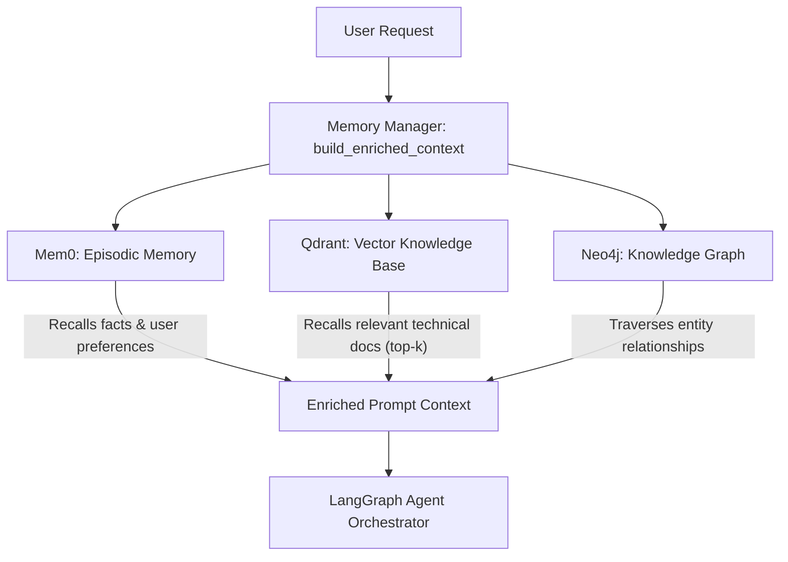

# Sovereign On-Premise Agentic AI Workbench — Architecture Guide

## 1. System Overview & Air-Gapped Principles

The **Sovereign AI Workbench** is a fully on-premise, air-gapped agentic AI workbench. It operates with **zero external cloud API calls**, running all models and infrastructure components locally in Docker containers:
- **FastAPI AI Service** (`sovereign-ai-service`, port 8000)
- **Node.js + Socket.IO Backend** (`sovereign-backend`, port 5000)
- **React Frontend** (`sovereign-frontend`, port 5173)
- **Host Ollama LLM / Embedder** (Host Windows runtime, port 11434 with automatic NVIDIA GPU / CPU fallback)
- **Qdrant Vector Database** (`sovereign-qdrant`, port 6333)
- **Neo4j Knowledge Graph** (`sovereign-neo4j`, port 7474 / 7687)
- **Valkey Memory Store** (`sovereign-valkey`, port 6379)
- **MongoDB** (`sovereign-mongodb`, port 27017)

---

## 2. Model Routing & Task Classification

The router ([`AI-SERVICES/llm/model_router.py`](file:///c:/Users/ayush/Desktop/sih2026-main/AI-SERVICES/llm/model_router.py)) classifies user prompts before generation into discrete task categories:

| Task Type | Assigned Model | Responsibility |
|---|---|---|
| `code_task` | `qwen2.5-coder:3b` | Code generation, debugging, syntax-highlighted solutions |
| `vision/multimodal_task` | `qwen2.5vl:3b` | Image analysis, technical diagrams, OCR |
| `file_operation` | `qwen2.5-coder:3b` | Sandboxed file creation, directory management, patching |
| `mixed/multi-step` | `qwen2.5-coder:3b` | Multi-step workflows (e.g. create file + run command) |
| `retrieval/memory_lookup` | `qwen2.5-coder:3b` / `nomic-embed-text` | Knowledge base search & memory recall |
| `general_chat` | `qwen2.5-coder:3b` | Conversational questions, planning, reasoning |

Startup model check script: [`AI-SERVICES/scripts/check_models.py`](file:///c:/Users/ayush/Desktop/sih2026-main/AI-SERVICES/scripts/check_models.py).
Health endpoint: `GET /api/health/models`.

---

## 3. Sandboxed Tool Registry & Execution

All file operations and terminal executions are strictly restricted to the workspace sandbox directory:
`AI-SERVICES/workspace` (container path: `/app/workspace`).

### Discovered & Implemented Tools (18 tools)
Exported machine-readable manifest: [`AI-SERVICES/tools/tools_registry.json`](file:///c:/Users/ayush/Desktop/sih2026-main/AI-SERVICES/tools/tools_registry.json)

1. **File Operations** ([`tools/file_tool.py`](file:///c:/Users/ayush/Desktop/sih2026-main/AI-SERVICES/tools/file_tool.py)):
   - `read_file`: Reads file contents inside sandbox with 5MB cap and line range slicing.
   - `write_file` / `create_file`: Writes or appends content to a file.
   - `create_directory`: Creates a folder.
   - `delete_file`: Deletes a file.
   - `move_file`: Moves or renames a file.
   - `patch_file`: Performs targeted search-and-replace edits and outputs a unified diff.
   - `list_directory` / `list_files`: Lists files, folders, and sizes.
   - `file_diff`: Generates unified diff between original and proposed content.

2. **Code & Terminal Execution** ([`tools/code_tool.py`](file:///c:/Users/ayush/Desktop/sih2026-main/AI-SERVICES/tools/code_tool.py), [`workflows/execution.py`](file:///c:/Users/ayush/Desktop/sih2026-main/AI-SERVICES/workflows/execution.py)):
   - `execute_python`: Executes Python scripts in an isolated subprocess; captures real stdout/stderr/exit code.
   - `execute_command`: Controlled terminal command runner with strict binary allowlist (`python`, `ls`, `dir`, `cat`, `echo`, `find`, `grep`, `pwd`, `date`, `whoami`, `git`), 15s timeout, and non-root execution.

3. **Document & Tabular Tools** ([`tools/document_tool.py`](file:///c:/Users/ayush/Desktop/sih2026-main/AI-SERVICES/tools/document_tool.py), [`tools/spreadsheet_tool.py`](file:///c:/Users/ayush/Desktop/sih2026-main/AI-SERVICES/tools/spreadsheet_tool.py)):
   - `create_pdf`: Compiles formatted PDF reports using ReportLab into `workspace/reports/`.
   - `inspect_document` / `extract_document_sections`: Text statistics and regex extraction.
   - `inspect_spreadsheet` / `filter_spreadsheet` / `write_spreadsheet`: CSV data analysis, statistical metrics (min/max/avg), and data writing.

4. **Vector & Knowledge Base** ([`tools/rag_tool.py`](file:///c:/Users/ayush/Desktop/sih2026-main/AI-SERVICES/tools/rag_tool.py)):
   - `search_knowledge_base`: Semantic vector search in Qdrant with `nomic-embed-text`.
   - `index_document`: Chunks and indexes text into Qdrant.

---

## 4. Tripartite Memory Architecture

Clear separation of responsibilities prevents logic overlap:

1. **Mem0 (`AI-SERVICES/memory/mem0_client.py`)**:
   - **Role**: "What should I remember long-term?"
   - Stores user preferences, operational facts, and past task outcomes.
   - Vector backend: Qdrant collection `sovereign_memories` with 768-dim `nomic-embed-text` embeddings.
2. **Qdrant (`AI-SERVICES/rag/`)**:
   - **Role**: Raw vector storage and semantic search over confidential documents, manuals, and SOPs.
   - Collection: `sovereign_documents`.
3. **Neo4j (`AI-SERVICES/memory/neo4j_client.py`)**:
   - **Role**: Explicit graph relationships between entities.
   - Schema:
     - Nodes: `(:User)`, `(:Conversation)`, `(:Document)`, `(:Task)`, `(:Tool)`, `(:Entity)`
     - Relationships: `(User)-[:STARTED]->(Conversation)`, `(Conversation)-[:HAS_TASK]->(Task)`, `(Task)-[:USED_TOOL]->(Tool)`, `(Task)-[:ACCESSED]->(Document)`.

---

## 5. Workflows Engine (`AI-SERVICES/workflows/`)

- **`workflow_engine.py`**: DAG pipeline runner executing planned steps with automatic retries and timing.
- **`coding_workflow.py`**: End-to-end coding pipeline (`qwen2.5-coder:3b` generation + optional sandbox execution).
- **`document_workflow.py`**: Research and PDF generation pipeline.
- **`analysis_workflow.py`**: Tabular data inspection and statistical filtering pipeline.
- **`execution.py`**: Low-level sandboxed execution runner with SHA-256 checksums and quota boundaries.
